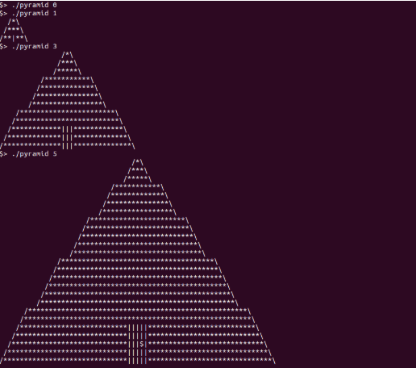

Pyramid 
Build your own pyramids, write your own code

Contents:
Genral instruction
Subject
Submission

Genral Instruction

Your project must be written in accrdance with the following Norm.

No functions can be more than 25 lines
Each function can accept a maximum of 4 parameters
Each file can have a maximum of 5 functions
All the variable declarations must be on the top of each function followed by an empty line
use of for loops is forbidden 
use of switch case is forbidden
use of printf or any other external C function is prohibited, unless explicitly mentioned

Only function mentioned is the subject is allowed

Your functions should not quit unexpectedly (segemnetation fault, bus error, double free, etc) apart from undefined behavoiurs. if this hapopens, your project will be considered non functional and will recieve a 0.

all heap allocated memory space must be properly freed when necessary.

only the folloeing libc functions are allowed : malloc(3), free(3),and write (2), and other usage is restricted

the expected output values of size is as follows:

